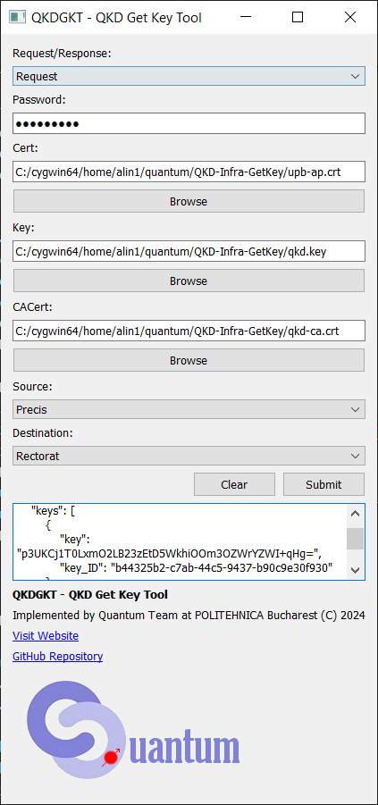

# QKD-Infra-GetKey

    
    

# Description

**QKDGKT - QKD Get Key Tool** is a user interface for QKD key access. It allows a priviledged user to access the internal QKD infrastructure at POLITEHNICA Bucharest.

# Installation

In order to install:
 - The software is designed for Linux, but can also work on Windows via WSL (activate WSL if using Windows)
- Install Python 3 and the packages from `requirements.txt` using `pip install -r requirements.txt`
- Rename `config_sample.json` to `config.json` and edit your personal details if needed
- Copy `.env.template` to `.env` and adjust the environment values
- Ensure that the `LOCATION` variable in `.env` matches one of the names listed
  in `config.json` (for example `Campus`)
- If your self-reporting endpoint uses a self-signed TLS certificate, set
  `REPORT_TRUST_SELF_SIGNED=true` in the `.env` file
- To enable authenticated self-reporting, set `REPORT_TOKEN` in the `.env` file
- Run `python qkdgkt_gui.py` to run the GUI
- Use utility functions from `qkdgkt.py` for development

# Usage

To use the QKD system, you need to fill in the following information:
 - Cert: Your personal signed SSL certificate
 - Key: Your personal key
 - CACert: The certificate associated to the CA
 - Source: The source QKD node
 - Destination: The destination QKD node

When querying for a reponse key, you need to:
 1. Select "Response" instead of "Request"
 2. Reverse the source and the destination
 3. Paste the ID of the key to be received in the ID field

# Copyright and license

This work has been implemented by Alin-Bogdan Popa and Bogdan-Calin Ciobanu, under the supervision of prof. Pantelimon George Popescu, within the Quantum Team in the Computer Science and Engineering department,Faculty of Automatic Control and Computers, National University of Science and Technology POLITEHNICA Bucharest (C) 2024. In any type of usage of this code or released software, this notice shall be preserved without any changes.

If you use this software for research purposes, please follow the instructions in the "Cite this repository" option from the side panel.

This work has been partly supported by RoNaQCI, part of EuroQCI, DIGITAL-2021-QCI-01-DEPLOY-NATIONAL, 101091562.
