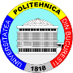

# QKD-Infra-GetKey

    
    

# Description

**QKDGKT - QKD Get Key Tool** is a user interface for QKD key access. It allows a priviledged user to access the internal QKD infrastructure at POLITEHNICA Bucharest.

# Installation

In order to install:
 - The software is designed for Linux, but can also work on Windows via WSL (activate WSL if using Windows)
 - Install Python and PyQT5
 - Rename `config_sample.json` to `config.json` and edit your personal details if needed
 - Run `python qkdgkt_gui.py` to run the GUI
 - Use utility functions from `qkdgkt.py` for development

# Usage

To use the QKD system, you need to fill in the following information:
 - Cert: Your personal signed SSL certificate
 - Key: Your personal key
 - CACert: The certificate associated to the CA
 - Source: The source QKD node
 - Destination: The destination QKD node

When querying for a reponse key, you need to:
 1. Select "Response" instead of "Request"
 2. Reverse the source and the destination
 3. Paste the ID of the key to be received in the ID field

# Copyright and license

This work is designed and implemented by Quantum Team at POLITEHNICA Bucharest. All rights reserved, (C) 2024.

If you use this software for research purposes, please follow the instructions in the "Cite this repository" option from the side panel.

The license to this work is TODO.
